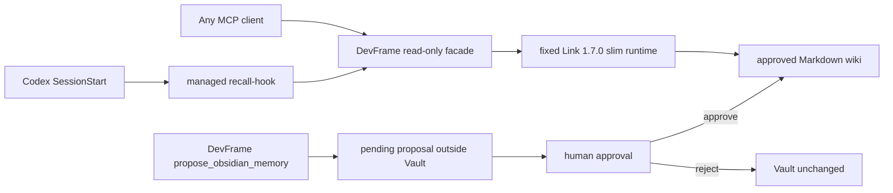
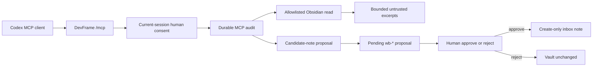

# Governed Obsidian Memory For Codex

Lifecycle state: implemented bounded zero-configuration MVP candidate; first-use
activation remains explicit and human-controlled, and the candidate is still
restricted to a dedicated disposable Vault until the final gates pass.

Recon receipt:
[RECON-OBSIDIAN-CODEX-MEMORY-MVP-20260718](../status/recon-receipt-obsidian-codex-memory-mvp.md)

This document describes the public runtime boundary implemented by the
DevFrame control plane. It is not an instruction to enable experimental Codex
features, index a private vault, or treat remembered text as project authority.

## Reader Outcome

After reading this document, a user should be able to:

1. keep Codex native Memories separate from a curated Obsidian knowledge base;
2. activate one dedicated Link-compatible Vault through an installed or
   editable DevFrame control plane;
3. expose only the governed `status` and `recall` facade tools while keeping
   Link's write/admin tools private;
4. understand the durable transaction, exact-payload approval, audit, and
   create-only write-back gates.

The current candidate also provides a one-time activation command that manages
the Codex MCP block and `SessionStart` hook. Subsequent sessions receive a
bounded recall capsule automatically; they do not require Obsidian to be open.

## Current zero-configuration activation

Run the command without `--confirm` first. It validates the dedicated Vault and
prints a path-redacted preview without installing a runtime or writing files:

```powershell
devframe memory activate --vault <dedicated-vault> --format json
```

After reviewing that preview, the one explicit first-use approval provisions an
isolated runtime, installs the control-plane plus exact `mcp==1.28.1` and
`link-mcp==1.7.0` from a complete Windows CPython 3.10 wheel lock in which every
runtime package has an exact version and SHA-256,
creates the Link-compatible `raw/` and `wiki/` layout, and adds reversible
managed blocks to the selected Codex home:

```powershell
devframe memory activate --vault <dedicated-vault> --confirm
devframe memory status
```

If a later external configuration rewrite completely removes the managed MCP
block while the activation record, instructions, hook, and Vault are still
exact, preview the bounded recovery before confirming it:

```powershell
devframe memory repair --format json
devframe memory repair --confirm
```

Repair restores only the absent MCP block and preserves the current unrelated
Codex configuration. Its preview remains zero-write and reports whether the
managed runtime facade needs a content refresh. On confirmation, a legacy or
stale facade is refreshed only when its dependency marker is still the exact
approved lock and the activation points to the runtime under the selected state
directory. Partial markers, a changed dependency contract, a same-name
unmanaged server, changed managed instructions or hooks, incompatible state,
or Vault drift are rejected. The repair updates its exact removal record so the
normal deactivation path can still remove only DevFrame-owned text.

Confirmed activation, repair, and deactivation are serialized by a
cross-process lifecycle lock. Before the first managed file changes, DevFrame
persists a bounded transaction record containing only managed text patches and
before/after hashes. A later confirmed lifecycle command completes an
interrupted transaction only when every target still matches an exact recorded
before or after state; unrelated concurrent edits fail closed. Config,
instructions, and hook bytes (including CRLF and compact JSON formatting) are
restored exactly when the managed text is removed.

The generated stdio server is `devframe-obsidian-memory`. Its protocol surface
contains only `status` and `recall`; Link's `remember`, `ingest`, `review`, and
`admin` tools are not proxied to any AI client. A managed `SessionStart` hook
calls the same bounded read plane and writes one untrusted, secret-scanned
capsule to hook stdout. Recalled Markdown can guide work but never overrides
system/developer instructions, repository rules, current source, tests,
evidence, review, or explicit human decisions.

The activation record is private local state under the selected state directory
(default: `~/.devframe/obsidian-memory`). Generated Codex config, AGENTS,
status, hook output, and MCP responses do not contain the absolute Vault path.
Other MCP-capable AI clients can use the same stdio command after passing the
same human-controlled configuration; the facade itself, rather than a client
allowlist, enforces the two-tool read-only boundary.

Automatic provisioning does not inherit host site-packages. An editable source
checkout is staged through its package source. An installed wheel instead
stages only `control_plane` files whose SHA-256 values match that installed
distribution's wheel RECORD, then installs that verified snapshot into the
isolated runtime after the complete exact-version/hash dependency lock. An
unknown or editable distribution without an approved source fails closed;
arbitrary external interpreter paths remain rejected. The runtime manifest also
binds a deterministic SHA-256 over every installed `control_plane` payload file.
An exact dependency marker with a legacy or different facade digest is refreshed
in place with a forced facade-only reinstall during confirmed activation or
repair and verified again before Codex configuration changes; fixed third-party
dependencies are not force-reinstalled and a different dependency marker is
never upgraded implicitly. Provisioning subprocesses receive a controlled
environment that excludes caller `PYTHONPATH`, `PYTHONHOME`, and `VIRTUAL_ENV`
while retaining explicit network proxy/index settings. If provisioning or a
later activation transaction fails, a runtime created by that attempt is removed
with the other managed changes. An existing runtime is never deleted by
rollback, and it is retained when an activation journal still requires it for
forward recovery.

To remove only the managed blocks, leave the Vault untouched, and require a
restart to take effect:

```powershell
devframe memory deactivate --confirm
```

If the activation state is present, the existing DevFrame
`propose_obsidian_memory` path automatically uses `wiki/memories` as its
create-only destination when the old memory environment variables are absent.
The proposal is staged outside the Vault, remains invisible to Link recall,
and carries `authority: candidate`, `status: proposed`, and
`review_status: pending`. Only after a separate human approval is it
materialized with
`authority: reviewed`, `status: active`, and `review_status: reviewed`. Explicit
legacy environment variables still take precedence for older/manual setups.

## Two Memory Layers

| Layer | Owner and storage | Intended use | Authority boundary |
|---|---|---|---|
| Codex native Memories | Codex host under `$CODEX_HOME/memories/` | Optional automatic local recall from eligible chats | Generated, experimental state; not the canonical project or team control surface |
| Curated Obsidian memory | A user-owned Markdown vault selected through `DEVFRAME_OBSIDIAN_MEMORY_ROOT` | Review-visible preferences, lessons, failure patterns, decisions, workflow rules, gotchas, and references | Untrusted guidance only; checked-in rules, current source, tests, evidence, and human decisions remain authoritative |

The layers are deliberately independent. This MVP does not write to
`$CODEX_HOME/memories/`, inject Obsidian notes into Codex's generated memory
files, or require Codex native Memories to be enabled. Required team guidance
still belongs in `AGENTS.md`, repository rules, or other checked-in documents.

The Codex Memories feature was reported as experimental and disabled on the
host inspected for this slice. No global Codex configuration was changed.

## Current zero-configuration runtime shape



The facade is the client-facing read boundary. Link remains a mature local
Markdown/index implementation behind it, while DevFrame remains the durable
write and approval authority.

## Legacy governed HTTP runtime shape



The implementation extends the existing MCP server, connection-consent store,
audit log, and write-back proposal lifecycle. It does not introduce a second
MCP transport, memory daemon, Obsidian plugin, vector database, or graph store.

Implementation entry points:

- [Obsidian memory adapter](../../packages/control-plane/control_plane/obsidian_memory.py)
- [MCP tool registration and dispatch](../../packages/control-plane/control_plane/mcp_server.py)
- [Connection consent and audit](../../packages/control-plane/control_plane/mcp_consent.py)
- [Human-gated create-only write-back](../../packages/control-plane/control_plane/writeback.py)

## Configuration

Configure the dashboard process before it starts:

| Environment variable | Required | Meaning |
|---|:---:|---|
| `DEVFRAME_OBSIDIAN_MEMORY_ROOT` | yes | Existing Obsidian vault directory. The server resolves it locally and never returns the absolute root to the MCP client. |
| `DEVFRAME_OBSIDIAN_MEMORY_ALLOWLIST` | yes | Non-empty list of vault-relative `.md` paths. Retrieval enforces it, and consent/proposal authority fingerprints bind to it. A JSON array is the recommended portable form. Newlines or the host path separator are also accepted. |
| `DEVFRAME_OBSIDIAN_MEMORY_INBOX` | no | Vault-relative candidate folder. Default: `_devframe/memory-inbox`. It must not be absolute, traverse upward, or enter `.obsidian/`. |
| `DEVFRAME_OBSIDIAN_MEMORY_STATE_DIR` | no | Activation state directory used by the existing proposal path when the three legacy memory variables are absent. Default: `~/.devframe/obsidian-memory`; state-derived writes use `wiki/memories`. |
| `DEVFRAME_MCP_TOKEN` | no on loopback | Existing MCP transport token. If configured, `/mcp` requires it. Keep the dashboard on loopback unless remote exposure has been separately reviewed. |

Example PowerShell configuration for a disposable vault:

```powershell
$vault = Join-Path $env:TEMP "devframe-memory-vault"
$runtime = Join-Path $env:TEMP "devframe-memory-runtime"
New-Item -ItemType Directory -Force $vault, $runtime | Out-Null

@'
---
project_id: demo
authority: reviewed
freshness: current
---
# Verification memory

Keep memory retrieval bounded and preserve source metadata.
'@ | Set-Content -LiteralPath (Join-Path $vault "memory.md") -Encoding utf8

$env:DEVFRAME_OBSIDIAN_MEMORY_ROOT = $vault
$env:DEVFRAME_OBSIDIAN_MEMORY_ALLOWLIST = '["memory.md"]'
$env:DEVFRAME_OBSIDIAN_MEMORY_INBOX = '_devframe/memory-inbox'

devframe dashboard serve --runtime-dir $runtime --host 127.0.0.1 --port 8765
```

Connect a compatible MCP client to `http://127.0.0.1:8765/mcp` only when using
the legacy HTTP path above. That path remains available for explicit allowlist
and consent experiments; the current zero-configuration activation uses the
managed local stdio facade instead and edits only marked Codex blocks after
`--confirm`.

The allowlist is a server boundary, not merely a search hint. Every retrieval
call must also provide a non-empty `relativePaths` subset. The adapter never
recursively discovers notes, expands globs, reads `.obsidian/`, accepts an
absolute caller path, or falls back to scanning the vault.

In activation-managed mode, the read facade owns bounded Link recall and does
not use this caller-selected legacy allowlist. The existing HTTP
`search_obsidian_memory` contract remains explicit and allowlist-bound.

## MCP Tools

### `search_obsidian_memory`

Required arguments:

```json
{
  "projectId": "demo",
  "query": "bounded retrieval",
  "relativePaths": ["memory.md"]
}
```

Optional `limit` is an integer from 1 through 8. The response contains bounded
excerpts and governance metadata, including a vault-relative source path,
content SHA-256, relevance score, declared and effective authority, freshness,
scope, and limitations. It never returns the absolute vault root.

Every excerpt is marked `untrustedReference: true` and has effective authority
`guidance_only`. Text inside a note must not be followed as an instruction,
accepted as evidence, or allowed to override current source, repository rules,
tests, reviews, or human decisions.

### `propose_obsidian_memory`

Required arguments:

```json
{
  "projectId": "demo",
  "title": "Bounded retrieval lesson",
  "lesson": "Select only the notes needed for the current task.",
  "memoryType": "workflow_rule",
  "sourceRefs": ["run-1/review.yaml"]
}
```

Supported `memoryType` values are `preference`, `lesson`, `failure_pattern`,
`design_decision`, `workflow_rule`, `gotcha`, and `reference`.

The server generates the note frontmatter, memory id, timestamp, filename, and
inbox path. The tool returns a `wb-*` request id and a redacted preview; it does
not write the vault. The candidate is marked `authority: candidate`,
`status: proposed`, and `privacy_classification: private_by_default`.

## Consent And Audit Gates

Ordinary MCP authorization is not sufficient for private memory access. Both
memory tools require a sensitive scope and all of the following:

1. the tool call records the requested scope;
2. a human approves the connection in the current server session;
3. the connection holds the matching `obsidian_memory_read` or
   `obsidian_memory_propose` scope bound to the current project, vault root,
   inbox, and allowlist fingerprint;
4. the pre-call audit event is durably appended before the adapter runs;
5. the result audit event is durably appended before a successful result is
   released.

A practical first-use sequence is:

1. connect the MCP client and make the intended memory call once;
2. observe the authorization or scope-required response;
3. list connections with `devframe mcp connections list`;
4. approve the displayed connection with
   `devframe mcp connections allow --id <connection-id>`;
5. retry the memory call.

If the next operation needs the other sensitive scope, a different project, or
a changed vault configuration, make that call once, approve the newly requested
bound scope, and retry. `allow-always` may restore the ordinary read scope for a
returning client, but it deliberately does not persist either memory scope.
Every new connection therefore needs a fresh human decision before it can
access private memory.

The memory audit records connection and client fingerprints, tool name,
authorization and result status, requested scope, authority fingerprint,
result count, and digests of the project id, selected relative paths, and
returned or proposed content. It
does not record the raw client name, project id, search query, note excerpts,
candidate lesson text, or absolute vault root. If the audit log cannot be
written, the memory call fails closed. A search result is withheld; a staged
candidate whose result cannot be audited is rejected rather than left pending.

## Candidate Write-Back Lifecycle

`propose_obsidian_memory` reuses the existing DevFrame write-back gate:

1. validate bounded fields and reject recognized credential assignments,
   access tokens, or private-key patterns in the original fields and generated
   note without echoing the rejected content;
2. generate a unique Markdown path under the configured inbox;
3. stage a thread-bound proposal under the selected DevFrame runtime directory;
4. protect the stored proposal with an integrity digest and claim it before
   applying;
5. expose a preview without the absolute vault root;
6. leave the vault unchanged until a human approves the matching `wb-*`
   request through the local approval flow;
7. on approval, re-check that the project, vault root, inbox, and allowlist
   fingerprint still match the staged authority boundary;
8. create exactly one new note with an exclusive create operation;
9. if the target appeared after staging, fail instead of replacing it.

The pending proposal store is local runtime state. It necessarily retains the
private apply root and proposed contents so a later approval can perform the
write, but those values are not included in the public MCP preview or memory
apply result. Rejecting the proposal leaves the vault unchanged.

## Security And Privacy Boundary

The adapter enforces these boundaries independently of client instructions:

- vault-relative Markdown paths only;
- an explicit, non-empty server allowlist plus a caller-selected subset;
- no globs, traversal, drive paths, UNC paths, NTFS alternate streams, Windows
  device aliases, `.obsidian/` access, symlinks, or junctions;
- strict UTF-8 notes, allowing at most one leading UTF-8 BOM while rejecting
  invalid UTF-8, NUL, embedded BOMs, or duplicate leading BOMs;
- bounded frontmatter, queries, excerpts, result counts, proposal fields, and
  source references;
- project and scope filtering before a note is returned;
- blocked, deprecated, or superseded notes omitted from results;
- notes containing recognized credential, token, or private-key patterns
  omitted without returning their note path or content;
- notes containing a native, POSIX, JSON-escaped, Unicode-escaped, or
  slash-escaped form of the configured absolute vault root omitted before
  frontmatter or excerpt processing;
- candidate title, lesson, source references, and generated note containing a
  recognized sensitive pattern rejected before a proposal is persisted;
- absolute vault paths redacted from MCP results, pending previews, and public
  apply results;
- a complete exact-version/SHA-256 runtime wheel lock, isolated-runtime
  identity checks, and rejection of host `site-packages` inheritance;
- a 96,000-character pre-parse ceiling on upstream read-plane JSON and smaller
  post-governance MCP/hook output limits;
- activation state bound to the exact Codex home, with status/deactivation
  rejecting missing or changed managed config, instructions, hook content, or
  generated chunks;
- confirmed lifecycle operations serialized across processes, with a durable
  forward-recovery journal and exact byte restoration for unrelated Codex
  files;
- the pending proposal payload byte-identical to the final create-only note, so
  approval never changes candidate bytes behind the human-visible gate.

The `/mcp` HTTP endpoint also rejects a declared request body larger than
8 MiB before reading it and decodes MCP JSON as strict UTF-8. Invalid,
incomplete, or non-UTF-8 bodies are rejected instead of being repaired with
replacement characters.

These controls reduce accidental disclosure; they are not a general secret
scanner or a proof that an allowlisted note is safe. Review the allowlist and
candidate contents as private data. Do not point the MVP at a real vault until
the owner has separately authorized the exact root and note list.

## Disposable-Vault Verification

Install the control-plane development dependencies as described in the
[Control Plane Quickstart](../../packages/control-plane/QUICKSTART.md), then run
the focused suite from the repository root:

```powershell
python -m pytest `
  packages/control-plane/tests/test_obsidian_memory_activation.py `
  packages/control-plane/tests/test_obsidian_memory.py `
  packages/control-plane/tests/test_mcp_consent.py `
  packages/control-plane/tests/test_mcp_server.py `
  packages/control-plane/tests/test_writeback.py `
  -q
```

The legacy explicit-environment HTTP adapter remains covered by
`test_memory_search_real_http_round_trip`: it starts the loopback dashboard,
initializes an MCP session, observes the authorization gate, records a current
human decision, retries the tool, and retrieves Chinese text from a temporary
vault. Those HTTP tests do not substitute for the zero-configuration Link
facade acceptance path.

For a disposable zero-configuration check, build and install the current wheel
in a fresh Windows CPython 3.10 environment, activate a new empty dedicated
Vault, and verify:

- installed `devframe memory activate|status|repair|deactivate` entrypoints and
  their preview/confirm exit codes;
- `codex mcp list/get` accepts the generated TOML and reports only `status` and
  `recall` as enabled tools;
- real stdio initialize/list/call uses the isolated Link runtime without a fake
  callback and returns neither Vault paths nor secret canaries;
- proposal returns a `wb-*` id while the final note is absent, and the proposal
  payload/hash exactly match the bytes eligible for apply;
- rejection leaves the Vault unchanged, while matching-thread approval creates
  one reviewed/active note and real Link recall returns its unique phrase;
- the exact command recorded in `hooks.json` returns one bounded untrusted
  capsule, and deactivation restores all pre-activation Codex file bytes while
  retaining the Vault, runtime, and approved memory.

## Current Limits And Deferred Evaluation

- The zero-configuration read plane delegates recall to fixed Link 1.7.0 but
  exposes only DevFrame's bounded `status` and `recall` facade. Link's internal
  schema/index behavior is an upstream dependency, not a DevFrame authority or
  automatic truth-maintenance system.
- The older explicit-environment adapter remains available for scoped legacy
  integrations. That adapter uses deterministic lexical scoring over a
  caller-selected subset of an explicit allowlist, with at most 32 paths, 8
  results, and 700 characters per excerpt; those limits do not describe Link's
  zero-configuration recall algorithm.
- A process interruption after a proposal is claimed leaves it in `applying`
  until a later approval request detects that the claiming process is gone.
  Recovery re-checks the bound authority and content digest, then either
  resumes the create-only write or verifies the already-created target before
  recording a recovery audit. A live claimant is never pre-empted.
- Static Windows junction/reparse-point rejection has a real-path probe, but
  path validation and the later open/write are not one atomic operation. A
  hostile concurrent filesystem mutation could still race the check, so use
  only a disposable, non-hostile vault tree for this MVP.
- Lifecycle locks coordinate DevFrame processes that share either the selected
  Codex home or activation state directory, using one fixed Codex-home-then-state
  lock order. An unrelated program can still rewrite Codex files without
  honoring those locks; exact hash mismatches stop recovery and require human
  inspection rather than overwriting the new content.
- The bundled dependency lock currently targets Windows CPython 3.10, the host
  used for this MVP. Other Python/platform combinations fail closed and need a
  separately generated, reviewed hash lock before support can be claimed.
- Runtime package versions, venv identity, paths, marker provenance, and the
  complete installed `control_plane` payload digest are re-probed before every
  facade call. Third-party dependency files are version-checked rather than all
  re-hashed after installation, so an actor with write access to the private
  runtime directory remains outside the full hostile-runtime threat boundary.
- Memory remains guidance only. This slice does not automatically promote
  candidates, synchronize cross-project memory, update existing notes, or
  resolve stale or conflicting memories; a human approval is the promotion
  event for the activation-managed `wiki/memories` destination.
- Startup recall reliability still needs a repeated fresh-task sample; a hook
  success proves delivery of a bounded capsule, not that every model will use
  recalled context perfectly.
- Obsidian Local REST API integration, mixed/private-vault use, automatic
  ingest/consolidation, and additional semantic or temporal retrieval remain
  separate evaluations.
- Native Codex Memories were not enabled globally, generated Codex memory files
  were not modified, and no real user vault was read while accepting this MVP.

Any future mixed/private-vault access, automatic plugin installation, automatic
promotion without a human gate, external index, or broader storage backend
requires a new human and Recon gate. The current activation itself is only
approved for a dedicated disposable Vault and the explicit `--confirm` action.
