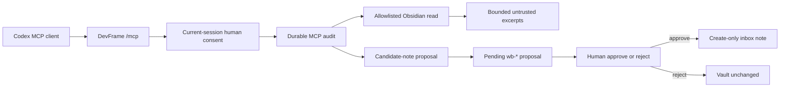

# Governed Obsidian Memory For Codex

Lifecycle state: implemented bounded MVP; not release-ready for unattended or
real private-vault use. Capability activation remains human-controlled.

Recon receipt:
[RECON-OBSIDIAN-CODEX-MEMORY-MVP-20260718](../status/recon-receipt-obsidian-codex-memory-mvp.md)

This document describes the public runtime boundary implemented by the
DevFrame control plane. It is not an instruction to enable experimental Codex
features, index a private vault, or treat remembered text as project authority.

## Reader Outcome

After reading this document, a user should be able to:

1. keep Codex native Memories separate from a curated Obsidian knowledge base;
2. expose only explicitly allowlisted Markdown notes through the existing
   DevFrame MCP server;
3. understand the current-session consent, durable audit, and human write-back
   gates;
4. validate the path with a disposable vault before considering a real vault.

## Two Memory Layers

| Layer | Owner and storage | Intended use | Authority boundary |
|---|---|---|---|
| Codex native Memories | Codex host under `$CODEX_HOME/memories/` | Optional automatic local recall from eligible chats | Generated, experimental state; not the canonical project or team control surface |
| Curated Obsidian memory | A user-owned Markdown vault selected through `DEVFRAME_OBSIDIAN_MEMORY_ROOT` | Review-visible preferences, lessons, failure patterns, decisions, workflow rules, gotchas, and references | Untrusted guidance only; checked-in rules, current source, tests, evidence, and human decisions remain authoritative |

The layers are deliberately independent. This MVP does not write to
`$CODEX_HOME/memories/`, inject Obsidian notes into Codex's generated memory
files, or require Codex native Memories to be enabled. Required team guidance
still belongs in `AGENTS.md`, repository rules, or other checked-in documents.

The Codex Memories feature was reported as experimental and disabled on the
host inspected for this slice. No global Codex configuration was changed.

## Runtime Shape



The implementation extends the existing MCP server, connection-consent store,
audit log, and write-back proposal lifecycle. It does not introduce a second
MCP transport, memory daemon, Obsidian plugin, vector database, or graph store.

Implementation entry points:

- [Obsidian memory adapter](../../packages/control-plane/control_plane/obsidian_memory.py)
- [MCP tool registration and dispatch](../../packages/control-plane/control_plane/mcp_server.py)
- [Connection consent and audit](../../packages/control-plane/control_plane/mcp_consent.py)
- [Human-gated create-only write-back](../../packages/control-plane/control_plane/writeback.py)

## Configuration

Configure the dashboard process before it starts:

| Environment variable | Required | Meaning |
|---|:---:|---|
| `DEVFRAME_OBSIDIAN_MEMORY_ROOT` | yes | Existing Obsidian vault directory. The server resolves it locally and never returns the absolute root to the MCP client. |
| `DEVFRAME_OBSIDIAN_MEMORY_ALLOWLIST` | yes | Non-empty list of vault-relative `.md` paths. Retrieval enforces it, and consent/proposal authority fingerprints bind to it. A JSON array is the recommended portable form. Newlines or the host path separator are also accepted. |
| `DEVFRAME_OBSIDIAN_MEMORY_INBOX` | no | Vault-relative candidate folder. Default: `_devframe/memory-inbox`. It must not be absolute, traverse upward, or enter `.obsidian/`. |
| `DEVFRAME_MCP_TOKEN` | no on loopback | Existing MCP transport token. If configured, `/mcp` requires it. Keep the dashboard on loopback unless remote exposure has been separately reviewed. |

Example PowerShell configuration for a disposable vault:

```powershell
$vault = Join-Path $env:TEMP "devframe-memory-vault"
$runtime = Join-Path $env:TEMP "devframe-memory-runtime"
New-Item -ItemType Directory -Force $vault, $runtime | Out-Null

@'
---
project_id: demo
authority: reviewed
freshness: current
---
# Verification memory

Keep memory retrieval bounded and preserve source metadata.
'@ | Set-Content -LiteralPath (Join-Path $vault "memory.md") -Encoding utf8

$env:DEVFRAME_OBSIDIAN_MEMORY_ROOT = $vault
$env:DEVFRAME_OBSIDIAN_MEMORY_ALLOWLIST = '["memory.md"]'
$env:DEVFRAME_OBSIDIAN_MEMORY_INBOX = '_devframe/memory-inbox'

devframe dashboard serve --runtime-dir $runtime --host 127.0.0.1 --port 8765
```

Connect a compatible MCP client to `http://127.0.0.1:8765/mcp` through that
client's normal, human-controlled configuration. This MVP does not edit global
Codex MCP configuration for the user.

The allowlist is a server boundary, not merely a search hint. Every retrieval
call must also provide a non-empty `relativePaths` subset. The adapter never
recursively discovers notes, expands globs, reads `.obsidian/`, accepts an
absolute caller path, or falls back to scanning the vault.

## MCP Tools

### `search_obsidian_memory`

Required arguments:

```json
{
  "projectId": "demo",
  "query": "bounded retrieval",
  "relativePaths": ["memory.md"]
}
```

Optional `limit` is an integer from 1 through 8. The response contains bounded
excerpts and governance metadata, including a vault-relative source path,
content SHA-256, relevance score, declared and effective authority, freshness,
scope, and limitations. It never returns the absolute vault root.

Every excerpt is marked `untrustedReference: true` and has effective authority
`guidance_only`. Text inside a note must not be followed as an instruction,
accepted as evidence, or allowed to override current source, repository rules,
tests, reviews, or human decisions.

### `propose_obsidian_memory`

Required arguments:

```json
{
  "projectId": "demo",
  "title": "Bounded retrieval lesson",
  "lesson": "Select only the notes needed for the current task.",
  "memoryType": "workflow_rule",
  "sourceRefs": ["run-1/review.yaml"]
}
```

Supported `memoryType` values are `preference`, `lesson`, `failure_pattern`,
`design_decision`, `workflow_rule`, `gotcha`, and `reference`.

The server generates the note frontmatter, memory id, timestamp, filename, and
inbox path. The tool returns a `wb-*` request id and a redacted preview; it does
not write the vault. The candidate is marked `authority: candidate`,
`status: proposed`, and `privacy_classification: private_by_default`.

## Consent And Audit Gates

Ordinary MCP authorization is not sufficient for private memory access. Both
memory tools require a sensitive scope and all of the following:

1. the tool call records the requested scope;
2. a human approves the connection in the current server session;
3. the connection holds the matching `obsidian_memory_read` or
   `obsidian_memory_propose` scope bound to the current project, vault root,
   inbox, and allowlist fingerprint;
4. the pre-call audit event is durably appended before the adapter runs;
5. the result audit event is durably appended before a successful result is
   released.

A practical first-use sequence is:

1. connect the MCP client and make the intended memory call once;
2. observe the authorization or scope-required response;
3. list connections with `devframe mcp connections list`;
4. approve the displayed connection with
   `devframe mcp connections allow --id <connection-id>`;
5. retry the memory call.

If the next operation needs the other sensitive scope, a different project, or
a changed vault configuration, make that call once, approve the newly requested
bound scope, and retry. `allow-always` may restore the ordinary read scope for a
returning client, but it deliberately does not persist either memory scope.
Every new connection therefore needs a fresh human decision before it can
access private memory.

The memory audit records connection and client fingerprints, tool name,
authorization and result status, requested scope, authority fingerprint,
result count, and digests of the project id, selected relative paths, and
returned or proposed content. It
does not record the raw client name, project id, search query, note excerpts,
candidate lesson text, or absolute vault root. If the audit log cannot be
written, the memory call fails closed. A search result is withheld; a staged
candidate whose result cannot be audited is rejected rather than left pending.

## Candidate Write-Back Lifecycle

`propose_obsidian_memory` reuses the existing DevFrame write-back gate:

1. validate bounded fields and reject recognized credential assignments,
   access tokens, or private-key patterns in the original fields and generated
   note without echoing the rejected content;
2. generate a unique Markdown path under the configured inbox;
3. stage a thread-bound proposal under the selected DevFrame runtime directory;
4. protect the stored proposal with an integrity digest and claim it before
   applying;
5. expose a preview without the absolute vault root;
6. leave the vault unchanged until a human approves the matching `wb-*`
   request through the local approval flow;
7. on approval, re-check that the project, vault root, inbox, and allowlist
   fingerprint still match the staged authority boundary;
8. create exactly one new note with an exclusive create operation;
9. if the target appeared after staging, fail instead of replacing it.

The pending proposal store is local runtime state. It necessarily retains the
private apply root and proposed contents so a later approval can perform the
write, but those values are not included in the public MCP preview or memory
apply result. Rejecting the proposal leaves the vault unchanged.

## Security And Privacy Boundary

The adapter enforces these boundaries independently of client instructions:

- vault-relative Markdown paths only;
- an explicit, non-empty server allowlist plus a caller-selected subset;
- no globs, traversal, drive paths, UNC paths, NTFS alternate streams, Windows
  device aliases, `.obsidian/` access, symlinks, or junctions;
- strict UTF-8 notes, allowing at most one leading UTF-8 BOM while rejecting
  invalid UTF-8, NUL, embedded BOMs, or duplicate leading BOMs;
- bounded frontmatter, queries, excerpts, result counts, proposal fields, and
  source references;
- project and scope filtering before a note is returned;
- blocked, deprecated, or superseded notes omitted from results;
- notes containing recognized credential, token, or private-key patterns
  omitted without returning their note path or content;
- notes containing a native, POSIX, JSON-escaped, Unicode-escaped, or
  slash-escaped form of the configured absolute vault root omitted before
  frontmatter or excerpt processing;
- candidate title, lesson, source references, and generated note containing a
  recognized sensitive pattern rejected before a proposal is persisted;
- absolute vault paths redacted from MCP results, pending previews, and public
  apply results.

The `/mcp` HTTP endpoint also rejects a declared request body larger than
8 MiB before reading it and decodes MCP JSON as strict UTF-8. Invalid,
incomplete, or non-UTF-8 bodies are rejected instead of being repaired with
replacement characters.

These controls reduce accidental disclosure; they are not a general secret
scanner or a proof that an allowlisted note is safe. Review the allowlist and
candidate contents as private data. Do not point the MVP at a real vault until
the owner has separately authorized the exact root and note list.

## Disposable-Vault Verification

Install the control-plane development dependencies as described in the
[Control Plane Quickstart](../../packages/control-plane/QUICKSTART.md), then run
the focused suite from the repository root:

```powershell
python -m pytest `
  packages/control-plane/tests/test_obsidian_memory.py `
  packages/control-plane/tests/test_mcp_consent.py `
  packages/control-plane/tests/test_mcp_server.py `
  packages/control-plane/tests/test_writeback.py `
  -q
```

The real HTTP acceptance path is covered by
`test_memory_search_real_http_round_trip`: it starts the loopback dashboard,
initializes an MCP session, observes the authorization gate, records a current
human decision, retries the tool, and retrieves Chinese text from a temporary
vault. Proposal tests confirm that the vault is unchanged before approval,
approval is bound to the originating thread, and create-only apply cannot
overwrite a file that appeared after staging.

For a manual disposable-vault check, use the configuration above, confirm that
`tools/list` advertises both memory tools, then verify:

- a call before approval returns an authorization error and no note text;
- a requested note outside `DEVFRAME_OBSIDIAN_MEMORY_ALLOWLIST` is rejected;
- search returns only vault-relative metadata and a bounded excerpt;
- proposal returns a `wb-*` id while the inbox note is still absent;
- rejection leaves the vault unchanged;
- approval creates one candidate note under the configured inbox.

## Current Limits And Deferred Evaluation

- Retrieval is deterministic lexical scoring over explicitly selected notes.
  There is no semantic index, full-text index, vector store, graph store, or
  automatic consolidation.
- A call can select at most 32 paths, return at most 8 results, and returns at
  most a 700-character excerpt per result. Individual notes are capped at
  256,000 bytes and the selected set at 2,000,000 bytes.
- Notes must be UTF-8 Markdown. Frontmatter must have a mapping root with scalar
  values; `tags` and `source_refs` may also be scalar sequences. Duplicate keys,
  aliases, anchors, explicit YAML tags, nested structures, malformed or
  unclosed frontmatter, and configured size-limit violations make the note
  unavailable. This is intentionally not a general Obsidian property parser.
- The server does not discover which allowlisted notes are relevant. The client
  must already have the approved relative paths for the current task.
- A process interruption after a proposal is claimed leaves it in `applying`
  until a later approval request detects that the claiming process is gone.
  Recovery re-checks the bound authority and content digest, then either
  resumes the create-only write or verifies the already-created target before
  recording a recovery audit. A live claimant is never pre-empted.
- Static Windows junction/reparse-point rejection has a real-path probe, but
  path validation and the later open/write are not one atomic operation. A
  hostile concurrent filesystem mutation could still race the check, so use
  only a disposable, non-hostile vault tree for this MVP.
- Memory remains guidance only. This slice does not promote candidates,
  synchronize cross-project memory, update existing notes, or resolve stale or
  conflicting memories automatically.
- Obsidian Local REST API integration, live private-vault verification, and
  semantic or temporal retrieval remain separate evaluations.
- Native Codex Memories were not enabled globally, generated Codex memory files
  were not modified, and no real user vault was read while accepting this MVP.

Any future real-vault access, global Codex configuration change, automatic
promotion, external index, or broader storage backend requires a new human and
Recon gate.
