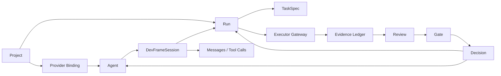

# Visual Control Plane

This document defines the product-level shape of the future dev-frame-system
client.

The existing runtime docs explain individual entrypoints such as `/rdgoal` and
`/rdpaper`. This document explains how those entrypoints fit into one
governance-first control surface.

## Reader Outcome

After reading this document, a contributor should be able to answer two
questions:

1. Is a proposed feature part of the future control plane, or is it just
   another chat-client convenience?
2. Which core object, state transition, and review gate must the feature map
   to before it should be built?

## Why This Exists

dev-frame-system is already more than a prompt library, but it is not yet a
finished visual client.

Today the public surface is split across four entrypoints:

- `/rdinit` installs the operating layer into a project.
- `/bindChrome` binds a browser-hosted AI session to a project.
- `/rdgoal` routes software work through a controller and worker handoff.
- `/rdpaper` routes paper review through a privacy-gated review loop.

Those entrypoints are useful, but they do not yet explain the future product
shape. Without a shared product map, new visual work can drift toward a generic
single-model chat UI.

This document is the stop line against that drift.

## Product Boundary

The future control plane is not:

- a clone of a single-provider chat client;
- a generic remote shell for a web model;
- a place where two models talk without task boundaries;
- a dashboard that reports activity but cannot enforce gates.

The future control plane is:

- a local control surface for projects, agents, runs, evidence, and review;
- a governance layer above replaceable executors;
- a way to turn browser-hosted AIs into first-class managed agents;
- a product where every meaningful action lands in a protocol object.

In the CLI-era workflow, "external brain" describes a web AI used from outside
the local tooling. In the visual client, that same capability becomes an
internal managed agent. The concept survives; the product framing changes.

## Core Rule

Every visual feature must map to at least one core object and one controlled
transition.

If a feature cannot be expressed as a change to project state, agent state, run
state, evidence state, review state, or gate state, it is out of scope for the
first control plane.

## Core Objects

| Object | What it represents | Why it exists |
|---|---|---|
| `Project` | Goal, scope, policies, memory, allowed roots, and active runs | Keeps work grounded in one governed unit instead of one loose chat |
| `Provider Binding` | A browser-hosted AI session or other model endpoint bound to a project | Separates model access from role and workflow policy |
| `Agent` | `Provider Binding + role + scope + permissions + protocol profile` | Turns a model session into a managed participant |
| `DevFrameSession` | Provider-neutral conversation/session page with messages, tool calls, diffs, evidence, cost, tokens, gates, and actions | Lets provider-native sessions become local web objects without making one backend the product model |
| `Run` | A bounded unit of work with status, task packet, owner, and outcome | Makes work inspectable and resumable |
| `TaskSpec` | The machine-readable and human-readable contract for a run | Prevents vague execution |
| `Executor Gateway` | The bridge to Codex, Claude Code, shell, browser automation, or another runner | Keeps execution replaceable |
| `Evidence Ledger` | Verification output, diffs, logs, screenshots, summaries, and chain-of-custody records | Prevents fake green completion |
| `Review` | Independent objections, verdicts, and next-action recommendations | Separates execution from acceptance |
| `Gate` | Human gate, safety gate, privacy gate, release gate, or acceptance gate | Stops automation at the right boundary |
| `Decision` | The controller's chosen next move based on goals, evidence, and review | Keeps progress intentional instead of reactive |

## Object Relationships



The important part is not the names. The important part is that the control
plane owns the edges between these objects.

## DevFrameSession Contract

`DevFrameSession` is the first-class local representation of a provider-native
conversation, thread, transcript, or execution session. It is deliberately
provider-neutral:

- OpenCode can map JSONL events, session ids, tool calls, token/cost candidates,
  and changed files into it.
- Codex can map threads, runs, tool calls, diffs, token/cost data, and evidence
  into it.
- Claude Code can map transcript entries, tool calls, file changes, and reports
  into it.
- ChatGPT Web can map browser conversation messages, manual fallback notes,
  copied responses, and review evidence into it.

Minimum fields are `session_id`, `provider`, `agent_role`, `project_id`,
`task_spec_id`, `status`, `messages`, `tool_calls`, `changed_files`,
`diff_summary`, `evidence_refs`, `cost`, `tokens`, `gates`, and `actions`.
When available, `task_spec_path` and `report_path` may point to the local
TaskSpec and ExecutionReport used for handoff or review.

The control plane should store summaries and evidence references by default.
Raw transcripts, browser profile state, secrets, and private local paths remain
outside the public read model unless a human-approved runtime policy explicitly
allows them.

## Web AI Session Import

The control plane can import summary-only browser-hosted AI sessions from the
local runtime directory without persisting raw transcripts.

Drop JSON session summaries into `<runtime-dir>/web-ai-sessions/`, or use
`devframe web-ai import <summary.json>` to validate and write them. Each file
should include `session_id`, `provider`, `agent_role`, `project_id`,
`task_spec_id`, `status`, `messages`, `tool_calls`, `changed_files`,
`diff_summary`, `evidence_refs`, `cost`, `tokens`, `gates`, and `actions`.
Optional fields include `run_id`, `task_spec_path`, `report_path`, and
`native_refs`.

The read model projects these imports into:
- `DevFrameSession` pages with `native_refs.runtime = "web-ai-import"`,
- `Provider Binding` entries with `mode = "context_only"` and `health = "ready"`,
- `Agent` entries with `scope = "project"` and `permissions = ["read_context"]`.

If an imported session includes `native_refs.review_marker` and
`native_refs.review_verdict`, the read model also projects a read-only
`acceptance` gate for that Web AI review. Positive verdicts such as `proceed`
or `pass` become `status = "pass"`; stop/fail/block verdicts become
`status = "blocked"`. This gate is evidence for review flow only and does not
mutate the source session, browser state, or provider state.

Raw transcripts, cookies, browser profile exports, and secret material must not
appear in these summary files. `devframe web-ai import` recursively rejects
`raw_transcript`, `transcript`, `conversation`, `raw_messages`, and raw
`messages[].content` / `messages[].text`; use `content_summary` only. The import
path is one-way and read-only; the control plane never writes back into the
source session files.

## Operating Modes

The product should support three modes without changing the underlying
governance contract.

### 1. Legacy External-Brain Mode

The user stays in Codex, Claude Code, or a terminal workflow and binds a web AI
session as the external brain.

Use this mode when the visual client is not in the loop, or when the user wants
the old slash-command workflow.

### 2. Managed Agent Mode

The user works inside the visual client. Browser-hosted AIs are no longer
"outside"; they are managed agents with explicit roles such as coordinator,
reviewer, paper reviewer, or contradiction checker.

This is the primary future mode.

### 3. Context-Only Mode

A provider may be allowed to read context, plan, and review without receiving
direct execution authority. This is the safe mode for expensive, weak, or
unstable providers and for "context bundle" style use cases.

## Agent Roles

The first control plane does not need unlimited agent types. It needs a few
clear roles:

- `Coordinator Agent`: keeps the project goal, constraints, and next decision.
- `Reviewer Agent`: attacks the current plan or evidence and looks for gaps.
- `Executor Agent`: performs bounded work through an execution tool.
- `Paper Reviewer Agent`: judges paper quality, structure, and citation risk.
- `Human Reviewer`: approves or blocks the gates that must stay human.

An agent is not defined by brand alone. It is defined by what it is allowed to
decide and what evidence it must return.

## Interaction Pattern

The control plane must prefer structured disagreement over free-form model chat.

Good pattern:

1. The coordinator defines the goal and task boundary.
2. A reviewer attacks the plan or asks for missing evidence.
3. An executor performs the bounded task.
4. Evidence is collected into the ledger.
5. A reviewer or human checks the result.
6. The controller records the next decision: continue, revise, stop, or
   escalate.

Bad pattern:

- two model tabs debating without a task boundary;
- an executor approving its own work;
- a UI that shows messages but not evidence or gate state;
- a run that can continue after a hard-stop condition.

## Mapping To Today's Entrypoints

The current public entrypoints remain valid. They become front doors into the
same object model.

| Entrypoint | Future meaning inside the control plane |
|---|---|
| `/rdinit` | Create the initial `Project` contract and local operating boundary |
| `/bindChrome` | Create or refresh a `Provider Binding` |
| `/rdgoal` | Start or continue a governed software `Run` |
| `/rdpaper` | Start or continue a governed paper-review `Run` |

This means the visual client should not replace those entrypoints with unrelated
UI actions. It should surface them as first-class workflows.

## What To Borrow

The control plane should borrow patterns, not identities.

| Source idea | What to borrow | What not to copy |
|---|---|---|
| CodexPro | Visual result cards, handoff/watch separation, context-only fallback, narrow tool surfaces | Single-provider product framing |
| DevSpace | Approved roots, owner approval, workspace/worktree handling, local bridge discipline | Treating local tool access as the whole product |
| T3 Code | The idea of an agent control plane with session visibility | Stopping at session orchestration without governance objects |
| Loop Mode | Long-goal persistence, resume anchors, finite monitor budgets | Endless looping without explicit stop conditions |
| Ponytail | Anti-overbuilding review pressure and delete-first thinking | Turning minimalism into a ban on useful product structure |

## Open Source Reuse Direction

Visual control-plane work is reuse-first. Before building a new agent UI,
session runtime, terminal surface, diff viewer, or provider adapter from
scratch, follow `rules/open-source-reuse.md`.

The current default reuse map is:

- T3 Code is the first visual-client candidate for coding-agent session
  visibility, WebSocket-style session updates, and control-plane interaction
  patterns.
- OpenCode is the first local coding-agent runtime and provider reference for
  executor behavior, agent modes, session metadata, and CLI/desktop boundaries.
- Devframe keeps ownership of project contracts, external-brain workflow
  semantics, evidence, review, gates, and controller decisions.

This means the first product slice should improve the local visual workbench and
adapter boundaries before attempting a broad fork, vendored UI import, or
provider-specific chat clone.

## First Build Slice

The first visual control plane should stay thin.

It should include:

- a project list with current goal, risk state, and active runs;
- an agent registry that shows provider, role, scope, and health;
- a session list that turns provider-native conversations into local inspectable
  `DevFrameSession` pages;
- a run view that shows TaskSpec, evidence, review, and current decision;
- a gate view that makes blocked and human-required states obvious;
- handoff and resume controls for `/rdgoal` and `/rdpaper`;
- manual fallback support when a provider cannot be safely automated.

It should not include:

- a full replacement chat client for each provider;
- remote execution relay as the default path;
- autonomous multi-agent debate without explicit gates;
- "one click ship" behavior for real-world irreversible effects.

## Design Test For New Features

Before building a visual feature, ask:

1. Which core object does this create, change, or inspect?
2. Which state transition does it control?
3. Which evidence or review artifact must appear if it succeeds?
4. Which gate must block it when the risk boundary is crossed?
5. Could this feature still make sense if the underlying model provider changed?

If those questions do not have crisp answers, the feature is probably UI drift.

## Near-Term Implementation Guidance

The near-term roadmap should stay contract-first:

- keep provider bindings replaceable;
- keep execution adapters replaceable;
- keep evidence and review schemas stable;
- let the visual layer read and drive the existing runtime objects before it
  invents new private state.

The first machine-readable read model is
`schemas/visual_control_plane_state.schema.json`. The starter state template is
`packages/control-plane/templates/visual_control_plane/CONTROL_PLANE_STATE.yaml`.
Together they define the data shape a thin GUI or CLI inspector can consume
before a full visual client exists.

The local client entrypoint is:

```powershell
devframe client --dry-run --runtime-dir C:\Users\you\.devframe-runtime
devframe client bridge --runtime-dir C:\Users\you\.devframe-runtime --output .\devframe-t3-bridge
devframe client serve --runtime-dir C:\Users\you\.devframe-runtime --open
```

`devframe client` is the zero-config launch path for the Local Agent Client. It
prints or serves `/client-plan.json`, which records the browser URL, endpoint
map, T3 Code bridge status, OpenCode executor status, MIT-licensed reuse
boundary, and read-only write policy.

The dashboard also exposes `/client-manifest.json`, backed by
`schemas/visual_client_manifest.schema.json`. That manifest is the first
machine-readable adapter contract for a reused visual client such as T3 Code:
it names the same-origin read endpoints, maps them to DevFrame governance
objects, records the T3 Code/OpenCode/DevFrame responsibility split, and marks
the surface as default-read-only with one human-gated local mutation path:
`POST /actions/execute` for queued go-run execution after loopback, same-origin,
and explicit confirmation checks pass.
The T3 bridge bundle is `/t3-bridge.json`, backed by
`schemas/t3_bridge_bundle.schema.json`. It records the exact Vite env values,
generated bridge files, the `devframe.t3web.mjs` launcher, and T3-side wiring
points needed to make a local T3 Code checkout read DevFrame's shell snapshot
and thread detail projection without copying T3 source into this repository.
`devframe client bridge
--output <dir>` writes that bundle to disk; `devframe client bridge --t3-root
<t3code-checkout>` installs only generated bridge files into a local T3 checkout
and refuses to overwrite existing files unless `--force` is explicit. A forced
install patches T3 Web's `apps/web/src/state/shell.ts` and
`apps/web/src/state/threads.ts` to use DevFrame's default-read-only projection when
`VITE_DEVFRAME_T3_SHELL_URL` is set, while T3's normal primary-environment
bootstrap reads DevFrame's `/.well-known/t3/environment` descriptor through
`VITE_HTTP_URL`. Run `node devframe.t3web.mjs` from the T3 checkout root to
start T3 Web with those environment values injected into the child process;
this avoids overwriting T3's `.env.local`.
The first T3-facing projection is `/t3-shell.json`, backed by
`schemas/t3_client_shell.schema.json`; it maps DevFrame projects and sessions
into T3-style project/thread shell snapshots and default-read-only thread
details while preserving DevFrame gates, actions, evidence references, and the
write policy as overlay fields. Action details now include `openUrl` links so
T3 message and plan Markdown can open the local DevFrame controlled-action page
without forking T3 UI behavior.

The current default-read-only CLI export is:

```powershell
devframe visual-state --runtime-dir C:\Users\you\.devframe-runtime
devframe visual-state --runtime-dir C:\Users\you\.devframe-runtime --format html --output visual-state.html
devframe actions --runtime-dir C:\Users\you\.devframe-runtime
devframe actions --runtime-dir C:\Users\you\.devframe-runtime --status open --source-type gate --fail-on-match
devframe actions --runtime-dir C:\Users\you\.devframe-runtime --paper-project D:\papers\demo --source-id demo-paper-paper-review
devframe actions --runtime-dir C:\Users\you\.devframe-runtime --paper-project D:\papers\demo --status ready --source-type run --format markdown --output ACTION_QUEUE.md
devframe client --dry-run --runtime-dir C:\Users\you\.devframe-runtime
devframe client bridge --runtime-dir C:\Users\you\.devframe-runtime --output .\devframe-t3-bridge
devframe client bridge --runtime-dir C:\Users\you\.devframe-runtime --t3-root D:\t3code --force
cd D:\t3code
node devframe.t3web.mjs
devframe client serve --runtime-dir C:\Users\you\.devframe-runtime --open
devframe dashboard serve --runtime-dir C:\Users\you\.devframe-runtime
devframe dashboard serve --runtime-dir C:\Users\you\.devframe-runtime --paper-project D:\papers\demo
```

The read model should carry enough local handoff detail to continue work from
the dashboard without turning the T3 shell into a free-form command runner:
packet path, TaskSpec path, ExecutionReport path, the current controller
decision, and the next safe local command. The one sanctioned mutation path is
the controlled action flow for queued go-runs: open `/actions/open?action_id=...`
from T3 or the dashboard, inspect the command, then submit a same-origin
confirmation to `/actions/execute`.
Project-level dispatch is the other sanctioned browser mutation path:
`/go/dispatch` lives on the dashboard surface, not in the T3 thread shell. It
reuses the same registered project roots already visible in the control plane
and prepares or starts `/go` shards without inventing a second orchestration
model.
Paper workspaces can be attached explicitly with `--paper-project`; they appear
as `rdpaper` runs with a privacy gate, manual-fallback next command, and
`WEB_AI_ADAPTER.yaml` provider binding health plus manual fallback instructions.
Provider health is mirrored into a safety gate with a concrete next action, so
`needs_login` and unsafe adapter settings are visible where reviewers already
look for blockers.
The dashboard Agent Registry also joins each agent to its provider binding so
role, scope, provider, binding id, binding health, and agent status can be
reviewed without cross-referencing another table.
The state also includes a dashboard Gate Focus section for active gates, with
the matching action id, copyable resume filter, and served Markdown handoff
link when endpoint links are available. Queued go-runs also expose a controlled
action page and explicit execute affordance through the same action metadata. A
default-read-only Action Queue derived from gates, runs, and decisions lets the
first dashboard viewport and `devframe actions` show the current local work
list.
The actions CLI can filter by status, priority, source
type, source id, and action id, and can render a filtered queue as Markdown for
manual resume or Web AI handoff. Text and Markdown queue views include each
`action_id` so single-action handoffs remain traceable, and the dashboard
Action Queue shows the same ids beside each row. Text, Markdown, and dashboard
queue views include a copyable `--action-id` resume filter for the same item;
`--fail-on-match` only changes the exit code and does not execute or mutate the
listed actions. The local dashboard
also exposes `/client-manifest.json` for reuse-client discovery,
`/client-plan.json` for zero-config local client launch metadata,
`/t3-bridge.json` for the installable T3 Code bridge bundle,
`/t3-shell.json` for a T3 Code facing shell and thread-detail snapshot,
`/actions.json` for the same queue, with `status`, `priority`, `source_type`,
`source_id`, and `action_id` query filters, `/actions.md` for the Markdown
handoff view, `/actions/open` for a local controlled-action page, and
`/actions/execute` for the confirmed loopback execute path. The same dashboard
also exposes `/go/dispatch` as the project-level browser entry for `/go`
prepare/execute requests. Invalid filter values return `400` so automation
cannot silently convert typos into an empty queue, unsupported action POSTs
return `409`, and cross-origin execution attempts return `403`.

The first strong version of the control plane is not the prettiest one. It is
the first one that makes every important workflow state visible and governed.
