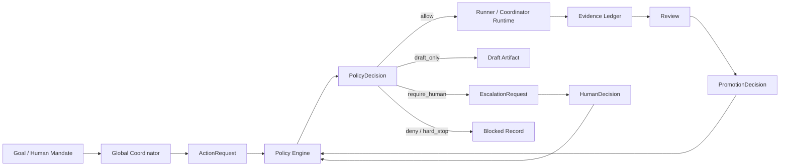

# Total-Control Policy Engine And Human Escalation Governance Plan

Lifecycle state: Historical plan; scheduling superseded by `HANDOFF.md`

Reader: DevFrame maintainers evaluating and designing the next governance layer for the Global Coordinator and rdgoal total-control path

Post-read action: critique and design the policy decision and human escalation model before enabling autonomous promotion, model routing, or write-capable Global Coordinator behavior

Related docs: [rdgoal Total-Control Orchestration](../agent-runtime/rdgoal-total-control.md), [Visual Control Plane](../agent-runtime/visual-control-plane.md), [Global Coordinator Conversation Plan](../status/phase-1-global-coordinator-conversation-plan.md), [Cluster Coordinator Design And Roadmap](../status/cluster-coordinator-design-and-roadmap.md), [Runtime Governance And Evidence Closure Transformation Plan](runtime-governance-and-evidence-closure-transformation-plan.md), [Evaluation, Feedback, And Learning Governance Plan](evaluation-feedback-learning-governance-plan.md), [Project And Cross-Project Memory Harness Governance Plan](project-and-cross-project-memory-harness-governance-plan.md)

Promotion target: `docs/agent-runtime/total-control-policy-and-escalation.md` after one bounded policy decision path, one human escalation path, and one blocked self-promotion path are proven with fixtures and runtime evidence

## Purpose

This plan defines the governance layer after evaluation and feedback learning.

Context management decides what the model sees. Documentation governance decides
which written guidance is authoritative. Runtime state and evidence decide what
actually happened. Evaluation and feedback learning decide what worked, what
failed, and what might improve.

The next question is different:

```text
Who is allowed to turn those findings into action?
```

The Global Coordinator cannot be treated as complete merely because it appears
as a first-class conversation. It needs a policy model that decides what it may
do, what it may only propose, what must be escalated to the human, what must be
denied, and what audit record must remain.

The goal is not to make the coordinator timid. The goal is to let it replace
routine human attention without silently inheriting unlimited human authority.

## Position In The Architecture

The project mainline becomes:

```text
Skill
  -> Workflow
  -> Context
  -> Documentation Governance
  -> Runtime State And Evidence
  -> Evaluation And Feedback Learning
  -> Total-Control Policy And Human Escalation
  -> Governed Execution / Promotion / Rollback
```

The policy layer sits between learning and mutation.

Evaluation may produce an observation. Feedback learning may produce an
improvement proposal. Only a policy decision and, where required, a human or
independent governance decision may promote that proposal into a default Skill,
workflow, context rule, model route, test suite, project memory, or release
action.

Three ideas must stay separate:

| Layer | Question | Output |
|---|---|---|
| Evaluation | What happened and how good was it? | Observation, scorecard, comparison |
| Learning | What should change? | ImprovementProposal |
| Authority | Who may make that change real? | PolicyDecision, EscalationRequest, PromotionDecision |

## Current Project Baseline

Audit date: 2026-07-03.

This assessment used current repository docs, CodeGraph context, and direct
inspection of the total-control and coordinator surfaces.

### rdgoal Already Contains A Controller Embryo

The rdgoal path is the strongest current authorization seed.

It already has:

- project contracts with a goal, non-goals, autonomy level, stop lines, owner,
  and prototype bias;
- a decision engine that classifies work into auto-execute, snapshot-execute,
  recommend-execute, draft-only, and hard-stop;
- dispatch packets as the boundary between the controller and workers;
- report ingest and runtime digest as a record of decisions and returned work;
- a conservative dry-run worker path for proving handoff before live execution.

This is a useful foundation, but it is still too narrow for the coming Global
Coordinator layer. It mostly classifies a requested operation. It does not yet
model every high-power system mutation, every promotion path, every human
escalation, or every principal/action/resource/context relationship.

### Global Coordinator Conversationization Is Real But Not Sufficient

The active Global Coordinator mainline has moved the product toward:

- `global_coordinator` as a first-class conversation kind;
- `goal_conversation` as the project-bound conversation created for one goal;
- early project binding before goal execution semantics matter;
- a one-call coordinator shell entry for RD-Code/T3 consumption;
- read-only Phase 1 shell behavior, with cluster composer and approval write
  paths deliberately disabled.

This is important product work. It changes the user's mental model from
"inspect a dashboard" to "hand a goal to a coordinator."

It does not yet create a persistent policy-driven Global Coordinator. The
conversation is becoming the operating surface, but policy authority is still
mostly distributed across rdgoal decisions, action queues, review gates, and
human-owned product judgment.

### Visual Control Plane Already Names The Right Objects

The visual control-plane model already points in the right direction. It names
Project, Provider Binding, Agent, DevFrameSession, Run, TaskSpec, Executor
Gateway, Evidence Ledger, Review, Gate, and Decision.

The missing piece is a policy layer over those objects:

- who is acting;
- what action is being requested;
- which project, run, Skill, rule, model route, memory entry, or release object
  is affected;
- which evidence, evaluation, review, and documentation authority support the
  action;
- whether the action is allowed, denied, drafted, shadowed, snapshotted, or
  escalated.

### Evaluation Governance Creates The Need For Authority Governance

The evaluation plan already separates acceptance, quality, efficiency,
reproducibility, and learning. It also warns that the system must not grade and
promote its own change.

That warning becomes the load-bearing requirement for this plan.

As soon as DevFrame can evaluate its own Skills, workflows, context policies,
and model routes, it also needs a rule for when those findings may change the
system. Without that rule, feedback learning becomes self-pollution:

```text
executor changes rule
  -> evaluator scores rule
  -> coordinator promotes rule
  -> future runs inherit unreviewed rule
```

The policy layer must break that loop.

## External Patterns Worth Reusing

The project should borrow concepts from mature systems rather than invent the
whole authority model from chat-first intuition.

### LangGraph: Durable Coordinator State And Interrupts

[LangGraph](https://github.com/langchain-ai/langgraph) is a good fit for
stateful long-running coordinator workflows. Its
[interrupt model](https://docs.langchain.com/oss/python/langgraph/interrupts)
is especially relevant: a graph can pause, persist state, wait for external
input, and resume from the saved state.

What DevFrame should borrow:

- pause/resume as a first-class runtime state;
- supervisor/sub-agent workflow structure;
- durable graph state for long goals;
- explicit handoff points where policy can inspect state before continuing.

What DevFrame should not outsource:

- final authorization semantics;
- evidence trust;
- human escalation policy;
- project contract interpretation.

LangGraph can be the orchestration engine. It must not become the governance
owner.

### OpenAI Agents SDK: Tool Approval As Run State

[OpenAI Agents SDK human-in-the-loop](https://openai.github.io/openai-agents-python/human_in_the_loop/)
shows a useful approval pattern: sensitive tools can require approval, the run
pauses with pending interruptions, and the serialized run state can be resumed
after approve or reject.

What DevFrame should borrow:

- tool and agent handoff approval as runtime interruption;
- approval/rejection attached to resumable state;
- guardrail results that can be logged and inspected later;
- the distinction between an agent proposing a tool call and the host deciding
  whether the call is allowed.

What DevFrame should add:

- project-local policy context;
- evidence and review references;
- documentation authority state;
- dirty-worktree and public-repo publication risk;
- promotion and rollback semantics.

### Temporal: Durable Waiting And Complete Decision History

[Temporal's human-in-the-loop AI workflow pattern](https://docs.temporal.io/ai-cookbook/human-in-the-loop-python)
is relevant because Global Coordinator goals can outlive one shell process, one
browser session, or one model run.

What DevFrame should borrow:

- human waiting as a durable workflow state, not an active compute loop;
- signal-style approval or rejection;
- timeouts and escalation deadlines that survive restarts;
- audit history for every decision.

DevFrame does not need to adopt Temporal in the first slice. It should design
records that do not make a later durable workflow backend impossible.

### OPA, Cedar, And Zanzibar: Authorization As A Separate Decision System

[Open Policy Agent](https://github.com/open-policy-agent/OPA) and
[Cedar](https://github.com/cedar-policy/cedar) both separate authorization
policy from application logic. Google's
[Zanzibar paper](https://research.google/pubs/zanzibar-googles-consistent-global-authorization-system/)
adds the relationship-based view: authorization depends on the relationship
between subjects, resources, and actions.

What DevFrame should borrow:

- policy decisions as pure decisions, not side effects;
- a principal/action/resource/context input shape;
- explicit allow, deny, and obligation outputs;
- policy tests and fixtures;
- relationship-aware permissions across projects, runs, agents, and humans.

What DevFrame should avoid initially:

- introducing a heavy policy runtime before the policy vocabulary is stable;
- making Rego or Cedar source the only readable contract for maintainers;
- scattering authorization rules across UI, runner, and evaluator code paths.

The first implementation can be schema-first and deterministic in Python while
remaining compatible with a future OPA or Cedar adapter.

### HumanLayer And 12-Factor Agents: Deterministic Code Owns Effects

[12-Factor Agents](https://github.com/humanlayer/12-factor-agents) frames an
agent loop as: the LLM proposes the next structured action, deterministic code
executes the action, and the result returns to context.

This is exactly the split DevFrame needs.

The Global Coordinator may reason and propose. The policy engine, gate layer,
runner, and finalizer decide whether effects are allowed and how they are
recorded.

### SWE-agent And OpenHands: Interface Design Is Capability Design

[SWE-agent](https://arxiv.org/abs/2405.15793) argues that agent-computer
interface design affects software-engineering performance. [OpenHands](https://arxiv.org/abs/2407.16741)
shows a broader software-agent platform with sandboxed execution, multi-agent
coordination, and benchmarks.

For DevFrame, this means the Global Coordinator conversation is not a skin. It
is an agent-computer and human-agent interface. It must expose:

- goal scope;
- current authority;
- pending escalations;
- next allowed action;
- evidence and review state;
- why a decision was allowed, blocked, or deferred.

If the conversation shows messages but hides authority state, the product will
feel conversational while remaining unsafe.

## Critical Findings

### P0: Human Authorization Scope Is Undefined

The cluster design says a human-issued `&goal` is the human's authorization.
That is useful, but incomplete.

Required clarification:

- `&goal` authorizes work toward a bounded goal, not unlimited system mutation;
- the authorization must bind to a project, goal conversation, and policy
  profile;
- the authorization should expire, narrow, or require renewal when the action
  class changes;
- an initial goal must not implicitly authorize release, deploy, secret access,
  paid external actions, public publication, default Skill promotion, model
  route promotion, or gate weakening.

Without this scope boundary, Phase D autonomy risks turning one user instruction
into a broad power of attorney.

### P0: Policy Decisions Are Not First-Class Runtime Records

Current decisions appear through rdgoal controller modes, action queues, review
gates, dashboard projections, and conversation state. They are useful, but not
yet one canonical policy record.

Required correction:

- define `PolicyDecision` as an explicit record;
- link it to the requesting subject, requested action, target resource, context
  packet, run record, evidence, evaluation, review, and project contract;
- make the decision outcome inspectable without replaying chat;
- prevent high-power effects from executing without a matching policy decision.

### P0: The System Must Not Promote Its Own Policy Changes

The policy layer itself becomes a critical system component. It must not be
self-modified by the same coordinator path it governs.

Required correction:

- policy changes are always proposed first;
- policy changes require independent review and human or governance approval;
- policy tests must include blocked self-promotion fixtures;
- no evaluator, coordinator, or executor may unilaterally promote a rule that
  changes its own future authority.

### P1: Current rdgoal Decisions Are Too Lexical For Global Authority

The rdgoal decision engine uses a project contract plus operation text and
targets. That is fine for the early controller path, but too weak for Global
Coordinator autonomy.

Required correction:

- classify by structured action type, not only keywords;
- include resource kind and sensitivity;
- include project state, dirty state, current phase, evidence quality, and
  escalation policy;
- separate recommendation from authorization.

### P1: Conversation Shell State Is Not Policy Runtime

The T3/RD-Code coordinator entry is intentionally read-only in the current
slice. It proves the shell and conversation model. It should not be mistaken
for a policy engine.

Required correction:

- keep Phase 1 shell behavior read-only until policy records exist;
- display policy state in the conversation, but do not let UI state become the
  source of truth;
- keep dashboard monitoring/configuration separate from approval authority.

### P1: Human Escalation Is A Policy Object, Not A Prompting Style

Asking the user a question in chat is not enough. A human escalation must have
state, scope, deadline, allowed responses, and audit data.

Required correction:

- define `EscalationRequest`;
- define `HumanDecision`;
- define allowed outcomes such as approve, reject, revise, defer, delegate, and
  narrow-scope;
- make escalation resumable after process restart;
- record what evidence was visible when the human decided.

### P1: Authority Depends On Relationships

A coordinator may be allowed to act on one project, one goal, one run, or one
agent but not another. A reviewer may approve evidence but not promote a Skill.
A human may approve a local change but not a remote deployment.

Required correction:

- model relationships between subjects, projects, runs, resources, and roles;
- avoid a flat global `admin` or `coordinator` permission;
- support project-level and global-level policy overrides without letting a
  project weaken global P0 rules.

### P2: Policy Testing Does Not Yet Exist

Authorization systems need negative fixtures more than happy-path demos.

Required correction:

- test missing evidence;
- test stale context;
- test dirty worktree publication risk;
- test executor self-approval;
- test evaluator self-promotion;
- test external side effects;
- test secret boundary;
- test conflicting review and evaluation results;
- test human approval with narrowed scope.

### P2: External Frameworks Can Accidentally Own Governance

LangGraph, OpenAI Agents SDK, Temporal, CrewAI, AutoGen, or any future framework
may provide useful runtime mechanics. None should become the DevFrame authority
model by accident.

Required correction:

- treat orchestration frameworks as execution backends or state machines;
- keep policy decisions in DevFrame-owned records;
- require adapters to emit DevFrame policy, evidence, review, and gate objects.

## Target Policy Model

### Core Records

| Record | Purpose |
|---|---|
| `AuthorityProfile` | Names what a subject can do by default, under which scope, with which expiry and source |
| `ActionRequest` | A structured request to observe, plan, draft, execute, mutate, promote, publish, or access something |
| `AuthorizationContext` | The evidence bundle used for a policy check: project contract, context packet, run state, evidence, review, evaluation, documentation authority, dirty state, and environment risk |
| `PolicyDecision` | The deterministic outcome of applying policy to one action request |
| `EscalationRequest` | A durable request for human or higher-authority input |
| `HumanDecision` | The recorded approve, reject, revise, defer, delegate, or narrow-scope response |
| `PromotionDecision` | A governed decision that changes default behavior or stable docs |
| `DecisionReceipt` | The immutable audit summary attached to runs, conversations, action queues, and review reports |

### Subjects

Policy subjects should include at least:

- `human_owner`;
- `global_coordinator`;
- `project_coordinator`;
- `executor_agent`;
- `reviewer_agent`;
- `evaluator_agent`;
- `governance_finalizer`;
- `external_provider_binding`;
- `automation_or_scheduler`.

A subject is not only a model name. It is a role, scope, provider binding,
permission profile, and current runtime state.

### Action Classes

The first action taxonomy should be small and explicit:

| Action class | Examples | Default posture |
|---|---|---|
| `observe` | read status, summarize evidence, inspect docs | allowed if privacy and project scope permit |
| `plan` | propose next steps, split tasks, draft review focus | allowed inside project contract |
| `draft` | prepare patch, script, migration plan, release checklist | allowed when output is non-effectful |
| `execute_local_reversible` | run tests, generate local docs, edit allowed files | policy-dependent |
| `execute_local_destructive` | delete, overwrite, migration, dependency upgrade | require snapshot or escalation |
| `mutate_runtime_config` | edit roster, rules, Skills, model defaults | require policy decision and review |
| `promote_default` | make a Skill/workflow/context/model route default | require promotion decision |
| `external_side_effect` | push, deploy, publish, spend, remote data mutation | draft-only or human-required |
| `secret_access` | read or expose credentials, tokens, private keys | hard-stop unless explicitly governed by a separate secret protocol |
| `release_or_publication` | merge, tag, release, publish package, public docs promotion | human-required |

### Decision Outcomes

`PolicyDecision` should not be a boolean.

Minimum outcomes:

- `allow`;
- `allow_with_snapshot`;
- `allow_shadow_only`;
- `draft_only`;
- `require_human`;
- `require_independent_review`;
- `require_more_evidence`;
- `deny`;
- `hard_stop`.

Each decision must include:

- reason;
- matched policy rules;
- required obligations;
- expiration or scope;
- evidence references;
- escalation target if any;
- resume condition;
- audit visibility level.

### Human Escalation Policy

The Global Coordinator needs a configurable human escalation policy before it
can safely become persistent and cross-project.

The policy should answer:

1. Which action classes may run without asking?
2. Which action classes may be drafted but not executed?
3. Which action classes must ask immediately?
4. Which action classes can be deferred into an inbox?
5. Which action classes must stop, regardless of human convenience?
6. How long can a goal wait for a human decision?
7. Can the coordinator continue unrelated work while waiting?
8. Can a human approval be narrowed to one file, command, run, or time window?
9. Which evidence must be visible before the human decides?
10. Which decisions require a second reviewer or governance finalizer?

### Authority Invariants

The following invariants should be treated as product laws:

1. A model suggestion is not authority.
2. A coordinator role is not unlimited authority.
3. A human `&goal` is bounded authorization, not blanket delegation.
4. Policy decisions return decisions and obligations, not side effects.
5. Missing evidence cannot authorize a high-power action.
6. An executor cannot approve its own output.
7. An evaluator cannot promote its own rubric, Skill, workflow, or route.
8. A project policy cannot weaken global P0 safety rules.
9. A UI affordance cannot be the source of truth for permission.
10. Every high-power action must be explainable from durable records.

## Proposed Architecture



The policy engine should be called before effects, before promotion, and before
final authority claims.

It should not own execution. It should decide whether a proposed effect is
allowed and which obligations must be satisfied.

## Relationship To Current Total-Control Work

### rdgoal

rdgoal remains the controller path for project goals. Its decision modes should
become either a compatibility projection from `PolicyDecision` or an adapter
that writes `PolicyDecision` records alongside existing packets.

The existing modes map roughly as:

| rdgoal mode | Policy meaning |
|---|---|
| `auto_execute` | `allow` for routine reversible project work |
| `snapshot_execute` | `allow_with_snapshot` |
| `recommend_execute` | `allow` for recommendation, not necessarily execution |
| `draft_only` | `draft_only` or `require_human` depending on action class |
| `hard_stop` | `hard_stop` |

This mapping should be proven with fixtures before changing execution behavior.

### Global Coordinator Conversation

The conversation should become the primary surface for:

- showing current mandate and policy profile;
- presenting pending escalations;
- explaining why an action is allowed, blocked, or deferred;
- accepting bounded human decisions;
- linking to evidence and review.

It should not become the source of truth for policy decisions.

### Evaluation And Feedback Learning

Evaluation produces candidate learning. Policy decides whether that learning can
change defaults.

Examples:

- A model comparison may recommend a different model route. Policy may keep it
  explicit until sample size and confidence thresholds are met.
- A failure cluster may recommend a new Skill instruction. Policy may require a
  regression fixture and independent reviewer before promotion.
- A successful context packet pattern may recommend a new context template.
  Policy may allow shadow mode before default adoption.

### Documentation Governance

Policy should consume documentation authority state.

If a plan is draft-only, a coordinator cannot claim it as stable runtime
authority. If a status document is superseded, a policy decision should not cite
it as current authority unless it is used only as historical evidence.

## Phased Planning Path

### Phase 0: Authority Recon And Vocabulary

Purpose: inventory current authority-bearing paths before adding new behavior.

Work:

- list all current action sources: rdgoal, cluster run, T3 action queue,
  writeback, custom Skills, custom rules, run defaults, evaluation proposals,
  release scripts, and documentation promotion;
- classify current action words: execute, approve, pass, accept, promote,
  publish, release, write, draft, block, stop, defer;
- identify which paths already write durable decision records;
- identify which paths rely on UI state, chat text, or implicit conventions.

Exit criteria:

- authority vocabulary inventory exists;
- no implementation path is planned without a named action class;
- known policy gaps are linked from the Reviewer Index.

Hard stop:

- do not enable new coordinator write behavior during this phase.

### Phase 1: Contract-Only Policy Envelope

Purpose: define policy records without changing execution behavior.

Work:

- draft `AuthorityProfile`, `ActionRequest`, `AuthorizationContext`,
  `PolicyDecision`, `EscalationRequest`, and `HumanDecision` schemas;
- create positive and negative fixtures;
- map current rdgoal decision modes into the new envelope;
- define public-safe audit fields and private runtime-only fields.

Exit criteria:

- fixtures cover allow, draft-only, require-human, deny, hard-stop, and
  self-promotion blocked cases;
- schema examples are understandable without a live runtime;
- no existing runner consumes the new records yet.

### Phase 2: Read-Only Policy Projection

Purpose: make policy decisions visible without granting new authority.

Work:

- add a read-only policy decision projection over existing rdgoal decisions and
  action queue items;
- surface decision summaries in digest and coordinator conversation details;
- keep dashboard and T3 shell read-only for this layer;
- mark missing policy records explicitly rather than inventing pass states.

Exit criteria:

- reviewer can see why an action is ready, held, or blocked;
- missing policy state is visible;
- existing release verification remains green.

### Phase 3: Human Escalation Record

Purpose: make human escalation durable and scoped.

Work:

- define escalation request and human decision records;
- support approve, reject, revise, defer, delegate, and narrow-scope outcomes;
- link each human decision to the evidence visible at decision time;
- represent pending escalations in the Global Coordinator conversation inbox.

Exit criteria:

- one sample escalation can be created, inspected, answered, and resumed;
- narrowed approval cannot be reused outside its scope;
- stale or missing evidence blocks approval.

### Phase 4: Policy-Gated Promotion

Purpose: connect evaluation learning to governed promotion.

Work:

- require `PolicyDecision` before promoting Skills, rules, context templates,
  model routes, test suites, or stable docs;
- require independent review for any change that affects future evaluations or
  policy behavior;
- add blocked self-promotion fixtures;
- support shadow-only promotion decisions.

Exit criteria:

- an improvement proposal can be kept in draft, shadowed, promoted, or blocked;
- the executor/evaluator cannot promote its own change;
- rollback path is recorded for every promotion.

### Phase 5: Durable Wait And Resume Semantics

Purpose: make human waiting compatible with long-lived Global Coordinator goals.

Work:

- define wait states and resume conditions;
- decide whether first implementation is local-file durable state, LangGraph
  interrupt, Temporal-backed workflow, or an adapter-neutral contract;
- make timeout and escalation deadline explicit;
- allow unrelated safe work to continue while one goal waits.

Exit criteria:

- interrupted coordinator state can be resumed after process restart;
- expired escalation becomes blocked or deferred, not silently allowed;
- durable wait records do not store secrets or raw private transcripts.

### Phase 6: Global Coordinator Policy Engine

Purpose: make the persistent Global Coordinator act under a real policy model.

Work:

- apply policy to every coordinator action request;
- bind each goal to a mandate, project, policy profile, and escalation policy;
- make cross-project scheduling respect authority and resource limits;
- treat cross-project memory as a hint, not as an authority grant;
- keep global rules stronger than project-local overrides.

Exit criteria:

- Global Coordinator can continue routine reversible work without user prompts;
- high-power actions reliably escalate or block;
- every action has a decision receipt.

### Phase 7: Framework Adapter Boundary

Purpose: integrate orchestration tools without losing DevFrame authority.

Work:

- define how LangGraph interrupts map to EscalationRequest and HumanDecision;
- define how OpenAI Agents SDK approvals map to PolicyDecision;
- define how a future Temporal workflow stores wait and resume state;
- reject adapters that hide approval context or evidence.

Exit criteria:

- orchestration adapters emit DevFrame policy records;
- no framework-specific approval becomes the only audit trail;
- DevFrame remains source of truth for governance.

### Phase 8: Conversation UX For Authority

Purpose: make policy state legible in the Global Coordinator conversation.

Work:

- show current mandate and policy profile;
- show pending escalations and their scope;
- show why the next action is allowed, drafted, blocked, or waiting;
- show human decision controls only when the backend policy record requires
  them;
- keep dashboard as monitoring/configuration.

Exit criteria:

- a fresh user can tell what the coordinator is allowed to do;
- the user can approve a bounded action without granting unrelated authority;
- hidden policy errors do not appear as normal chat messages.

## Recommended Delivery Batches

### Batch A: Authority Inventory

Deliverables:

1. recon receipt for total-control policy and human escalation;
2. authority vocabulary inventory;
3. current action source inventory;
4. external pattern decision table;
5. updated Reviewer Index.

### Batch B: Policy Contracts

Deliverables:

1. draft policy schemas;
2. allow/draft/escalate/deny/hard-stop fixtures;
3. self-promotion blocked fixture;
4. rdgoal decision-mode mapping note;
5. schema validation tests.

### Batch C: Read-Only Projection

Deliverables:

1. policy decision projection from existing rdgoal/action queue state;
2. digest and conversation-detail display;
3. missing-policy warning;
4. no execution behavior change.

### Batch D: Escalation Prototype

Deliverables:

1. escalation request and human decision records;
2. one scoped human approval fixture;
3. one narrowed approval rejection fixture;
4. resume semantics documented.

### Batch E: Promotion Gate

Deliverables:

1. policy-gated improvement proposal flow;
2. independent-review requirement for self-affecting changes;
3. shadow-only promotion mode;
4. rollback receipt.

## Verification Strategy

Policy work should be verified with negative cases first.

Critical scenarios:

- routine reversible action is allowed;
- local destructive action requires snapshot;
- external side effect becomes draft-only or human-required;
- secret access hard-stops;
- missing context requires more evidence;
- stale documentation cannot authorize a stable claim;
- evaluator cannot promote its own rubric;
- executor cannot accept its own output;
- project policy cannot weaken global P0 rules;
- narrowed human approval cannot be reused for a broader action;
- denied policy decision cannot be bypassed through UI state;
- interrupted escalation resumes with the same scope and evidence.

Metrics:

- percentage of high-power actions with policy decisions;
- percentage of policy decisions linked to evidence;
- escalation response latency;
- number of blocked self-promotion attempts;
- number of policy bypass findings in review;
- number of actions downgraded from execute to draft-only;
- number of stale or missing-authority docs cited by proposed decisions;
- successful resume rate after interrupted human escalation.

## Explicit Non-Goals

- Do not implement a full OPA, Cedar, or Zanzibar clone in the first slice.
- Do not enable autonomous release, deploy, publish, push, payment, or remote
  production mutation.
- Do not let the Global Coordinator rewrite its own policy without independent
  review.
- Do not convert the dashboard into the approval surface.
- Do not treat chat confirmation as sufficient audit evidence.
- Do not start LangGraph migration before the authority contract is stable.
- Do not make model routing automatic before policy-gated evaluation cohorts
  exist.
- Do not store secrets, raw browser profiles, cookies, or private transcripts in
  policy records.

## Open Decisions

1. Should the first policy engine be a small DevFrame-owned Python evaluator, or
   should the contract be shaped around an OPA/Cedar adapter from the start?
2. Which policy fields are safe for public docs and which must stay in ignored
   runtime state?
3. How should a human approval expire: time, run boundary, goal boundary, file
   scope, action class, or all of the above?
4. Can one human decision approve a batch of homogeneous actions?
5. Which actions require a second reviewer instead of only the owner?
6. Should Global Coordinator policy be global-first with project overrides, or
   project-first with global guardrails?
7. How should policy conflicts be displayed when evaluation, review, project
   contract, and human preference disagree?
8. What is the minimal durable wait backend before adopting LangGraph interrupts
   or Temporal?
9. How should policy decisions be compacted for long-running goal conversations?
10. What is the first safe write-capable action to let the Global Coordinator
    execute under policy?

## Immediate Next Slice

The next useful work is Batch A only.

Deliverables:

1. `recon-receipt-total-control-policy-and-human-escalation.md`;
2. `total-control-authority-vocabulary-inventory.md`;
3. inventory of current action sources and authority-bearing code paths;
4. a reuse decision table for LangGraph, OpenAI Agents SDK HITL, Temporal, OPA,
   Cedar, Zanzibar-style relationship authorization, HumanLayer/12-factor
   agents, SWE-agent, and OpenHands;
5. updated Reviewer Index with the new planning surface.

Do not yet:

- add policy schemas;
- change rdgoal execution behavior;
- enable coordinator write actions;
- enable cluster composer execution;
- add LangGraph or Temporal dependencies;
- introduce automatic model routing or promotion;
- treat this planning document as implemented runtime.

This keeps the work in the thinking layer the user asked for while creating a
clear bridge to later implementation.

## Working Thesis

The Global Coordinator should be allowed to reduce user attention, not erase
user authority.

The right next layer is a policy engine and human escalation model that lets the
coordinator act boldly inside a bounded mandate, pause cleanly at high-power
boundaries, and leave an audit trail good enough for a future reviewer to
explain every important decision without rereading the chat.
